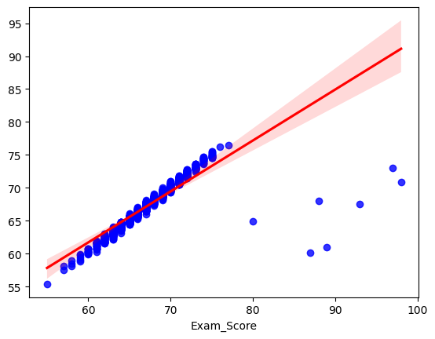

Projeto realizado com o intuito de treinar modelagem de dados.

# Etapas
* Ler os dados
* Análise exploratória
* Limpeza dos dados
* Criação de variáveis dummys
* Modelagem
* Previsão
* Plot valor real x predito

# Dataset

Foi utilizado o data set denominado "Student Exam Performance Dataset Analysis", obtido através do kaggle [aqui](https://www.kaggle.com/datasets/grandmaster07/student-exam-performance-dataset-analysis).

# Plot previsão do modelo
